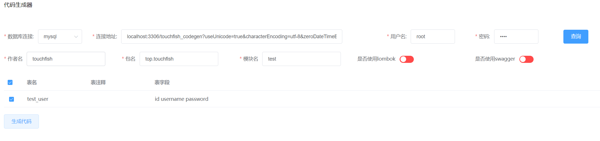
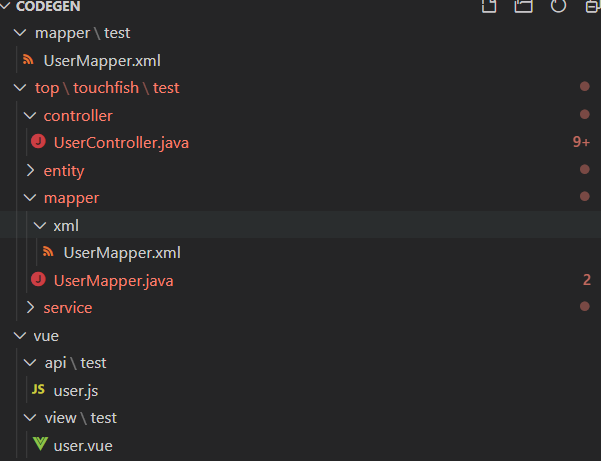

# touchfish-codegen

#### 介绍
mybatisplus的可视化代码生成

#### 简介
软件架构说明
使用springboot+mybatis-plus自带的代码生成做的一个可视化web代码生成

### 特点
- 可以生成一般的entity service mapper xml controller
- 在controller中自带了基本的crud以及分页查询接口
- 生成了基于vue-admin-template的api和vue 直接复制粘贴可用

## 使用
```
git clone本项目到本地
用ide打开
运行CodeGenApp里的main方法
打开Chrome浏览器输入localhost
数据库连接选择对应的数据库
在连接地址中输入ip端口和数据库 (mysql用户问好后面的参数不用变化)
输入用户名 密码
点击查询 结果后勾选你要生成代码的表
输如对应的作者 包名 模块名 
点击下方的生成代码
生成的压缩包会自动下载 名字为codegen.zip
解压复制代码到你自己的项目
```

### 修改模板文件
```
模板文件在 touchfish-codegen/src/main/resources/templates下
你可以自己修改模板文件 来配合你自己的项目
比如
 可以修改controller.java.vm中的通用返回类的导入来配合你自己的通用返回类 
```
#### TODO
- 代码优化
- 前后端权限判断生成
- 模板适配 适配更多的后端/前端框架
- 在线编辑模板
- 在线查看生成的代码
- 自定义通用返回类

#### 作者其项目 
- touchfish 一个分布式开发框架(完善中 静候开源)

## 目前进度


### 包名作者名以及其他配置如上图所示
### 生成的文件目录


### 测试表sql
```sql
CREATE TABLE `test_user` (
  `id` int NOT NULL AUTO_INCREMENT COMMENT '自增主键',
  `username` varchar(255) DEFAULT NULL COMMENT '用户名',
  `password` varchar(255) DEFAULT NULL COMMENT '密码',
  PRIMARY KEY (`id`)
) ENGINE=InnoDB DEFAULT CHARSET=utf8mb4 COLLATE=utf8mb4_0900_ai_ci;
```

### 生成的entity
```java
package top.touchfish.test.entity;

import com.baomidou.mybatisplus.annotation.TableName;
import java.io.Serializable;

/**
 * <p>
 * 
 * </p>
 *
 * @author touchfish
 * @since 2020-12-17
 */
@TableName("test_user")
public class User implements Serializable {

    private static final long serialVersionUID = 1L;

    /**
     * 自增主键
     */
    private Integer id;

    /**
     * 用户名
     */
    private String username;

    /**
     * 密码
     */
    private String password;


    public Integer getId() {
        return id;
    }

    public void setId(Integer id) {
        this.id = id;
    }

    public String getUsername() {
        return username;
    }

    public void setUsername(String username) {
        this.username = username;
    }

    public String getPassword() {
        return password;
    }

    public void setPassword(String password) {
        this.password = password;
    }

    @Override
    public String toString() {
        return "User{" +
        "id=" + id +
        ", username=" + username +
        ", password=" + password +
        "}";
    }
}
```
### 生成的mapper接口
```java
package top.touchfish.test.mapper;

import top.touchfish.test.entity.User;
import com.baomidou.mybatisplus.core.mapper.BaseMapper;

/**
 * <p>
 *  Mapper 接口
 * </p>
 *
 * @author touchfish
 * @since 2020-12-17
 */
public interface UserMapper extends BaseMapper<User> {

}

```

### 生成的service
```java
package top.touchfish.test.service;

import top.touchfish.test.entity.User;
import com.baomidou.mybatisplus.extension.service.IService;

/**
 * <p>
 *  服务类
 * </p>
 *
 * @author touchfish
 * @since 2020-12-17
 */
public interface UserService extends IService<User> {
    IPage<User> queryPage(Integer pageNum, Integer pageSize, User user);
}

```
### 生成的service实现类
```java
package top.touchfish.test.service.impl;

import top.touchfish.test.entity.User;
import top.touchfish.test.mapper.UserMapper;
import top.touchfish.test.service.UserService;
import com.baomidou.mybatisplus.extension.service.impl.ServiceImpl;
import org.springframework.stereotype.Service;
import com.baomidou.mybatisplus.core.conditions.query.LambdaQueryWrapper;
import com.baomidou.mybatisplus.core.metadata.IPage;
import com.baomidou.mybatisplus.extension.plugins.pagination.Page;
/**
 * <p>
 *  服务实现类
 * </p>
 *
 * @author touchfish
 * @since 2020-12-17
 */
@Service
public class UserServiceImpl extends ServiceImpl<UserMapper, User> implements UserService {

    /**
     * 分页查询
     * @param pageNum
     * @param pageSize
     * @param ${classname}Entity
     * @return
     */
    @Override
    public IPage<User> queryPage(Integer pageNum, Integer pageSize, UserEntity user) {
        IPage<User>  userIPage = new Page<>(pageNum, pageSize);
        // 查询条件自己通过queryWrapper构建
        LambdaQueryWrapper<User> queryWrapper = new LambdaQueryWrapper<User>();
        IPage<User> userPage = baseMapper.selectPage(userIPage, queryWrapper);
        return userPage;
    }
}

```
### 生成的controller
```java
package top.touchfish.test.controller;

import org.springframework.web.bind.annotation.RequestMapping;
import top.touchfish.test.service.UserService;
import top.touchfish.common.R;
import org.springframework.web.bind.annotation.RestController;

/**
 * <p>
 * 前端控制器
 * </p>
 *
 * @author touchfish
 * @since 2020-12-17
 */
@RestController
@RequestMapping("/test/user")
public class UserController {
  @Autowired
  private UserService userService;

  /**
   * 分页查询
   * 
   * @param pageNum
   * @param pageSize
   * @param ${classname}Entity
   * @return
   */
  @GetMapping("list")
  public R list(Integer pageNum, Integer pageSize, User user) {
    if (pageNum == null || pageNum < 0) {
      pageNum = 1;
    }
    if (pageSize == null || pageSize < 0) {
      pageSize = 10;
    }
    return R.success(userService.queryPage(pageNum, pageSize, user));
  }

  /**
   * 信息
   */
  @GetMapping("/info/{id}")
  public R info(@PathVariable("id") Integer id) {
    return R.success(userService.getById(id));
  }

  /**
   * 保存
   */
  @PostMapping("/save")
  public R save(@RequestBody User user) {
    userService.save(user);

    R.success();
  }

  /**
   * 修改
   */
  @PostMapping("/update")
  public R update(@RequestBody User user) {
    userService.updateById(user);

    R.success();
  }

  /**
   * 删除
   */
  @DeleteMapping("/delete/{ids}")
  public R delete(@PathVariable Integer[] ids) {
    userService.removeByIds(Arrays.asList(ids));
    R.success();
  }
}

```
### 生成的mapper.xml
```xml
<?xml version="1.0" encoding="UTF-8"?>
<!DOCTYPE mapper PUBLIC "-//mybatis.org//DTD Mapper 3.0//EN" "http://mybatis.org/dtd/mybatis-3-mapper.dtd">
<mapper namespace="top.touchfish.test.mapper.UserMapper">

</mapper>

```
### 生成的vue-admin-template的api
```js
import request from '@/utils/request'
/**
 * 条件查询列表
 * @param query
 */
export function userList(query) {
    return request({
        url: '/test/user/list',
        method: 'get',
        params: query
    })
}
/**
 * 根据id获取详情
 * @param Id
 */
export function userInfo(Id) {
    return request({
        url: '/test/user/info/' + Id,
        method: 'get'
    })
}
/**
 * 保存
 * @param data
 */
export function userSave(data) {
    return request({
        url: '/test/user/save',
        method: 'post',
        data
    })
}
/**
 * 更新
 * @param data
 */
export function userUpdate(data) {
    return request({
        url: '/test/user/update',
        method: 'post',
        data
    })
}
/**
 * 删除
 * @param data
 */
export function userDel(data) {
    return request({
        url: '/test/user/delete/' + data,
        method: 'delete'
    })
}

```

### 生成的vue-admin-template的view
```vue
<template>
    <div class="app-container">
        <!-- 搜索框 -->

        <!-- 新增 -->
        <el-row>
            <el-col>
                <el-button
                        type="primary"
                        icon="el-icon-plus"
                        size="mini"
                        class="pan-btn tiffany-btn"
                        @click="handleAdd"
                >新增</el-button>
            </el-col>
        </el-row>

        <!-- 列表 -->
        <el-table
                :data="dataList"
                border
                @selection-change="handleSelectionChange"
                style="width: 100%;">
            <el-table-column
                    type="selection"
                    header-align="center"
                    align="center"
                    width="50">
            </el-table-column>
    <el-table-column
            prop="id"
            header-align="center"
            align="center"
            label="自增主键">
    </el-table-column>
    <el-table-column
            prop="username"
            header-align="center"
            align="center"
            label="用户名">
    </el-table-column>
    <el-table-column
            prop="password"
            header-align="center"
            align="center"
            label="密码">
    </el-table-column>
            <el-table-column
                    fixed="right"
                    header-align="center"
                    align="center"
                    width="150"
                    label="操作">
                <template slot-scope="scope">
                    <el-button type="text"  size="small" @click="handleUpdate(scope.row)">修改</el-button>
                    <el-button type="text"  size="small" @click="deleteHandle(scope.row)">删除</el-button>
                </template>
            </el-table-column>
        </el-table>

        <!-- 分页 -->
        <pagination
                :total="total"
                :page.sync="queryParams.pageNum"
                :limit.sync="queryParams.pageSize"
                @pagination="getList"
        />

        <!-- 增加or修改弹窗 -->
        <el-dialog
                :title="title" :visible.sync="visible" width="30%">
            <el-form :model="dataForm" :rules="roles" ref="dataForm" @keyup.enter.native="submitHandler()" label-width="80px">
        <el-form-item label="自增主键" prop="id">
            <el-input v-model="dataForm.id" placeholder="自增主键"></el-input>
        </el-form-item>
            </el-form>
            <span slot="footer" class="dialog-footer">
      <el-button @click="visible = false">取消</el-button>
      <el-button type="primary" @click="submitHandler()">确定</el-button>
    </span>
        </el-dialog>
    </div>
</template>

<script>
    import { userSave, userList, userInfo, userUpdate, userDel } from '@/api/test/user'
    export default {
        data() {
            return {
                total: 0,
                dataList: [],
                visible: false,
                title: '',
                // 查询参数
                queryParams: {
                    pageNum: 1,
                    pageSize: 10,
                    key: undefined
                },
                ids: [],
                dataForm: {
        id: 0,
        username: ''
        password: ''
        }
        , // 表单校验
            roles: {
                        id: [
                        { required: true, message: '${column.comments}不能为空', trigger: 'blur' }
                    ]

            }
        }
        }, created() {
            this.getList()
        },
        methods: {
            // 获取列表
            getList() {
                    userList(this.queryParams).then(res => {
                    this.dataList = res.data
                        if (this.dataList.length > 0) {
                            this.total = res.total
                        }
                })
            },
            // 查询
            handleQuery() {
                this.queryParams.page = 1
                this.getList()
            },
            // 新增
            handleAdd() {
                this.title = '新增'
                this.visible = true
            },
            // 修改
            handleUpdate(row) {
                this.title = '修改'
                this.visible = true
                    userinfo(row.id).then(res => {
                    this.dataForm = res.data
                })
            },
            // 删除
            handleDelete(row) {
                const id = row.id || this.ids
                this.$confirm('是否确认删除编号为"' + id + '"的数据项?', '警告', {
                    confirmButtonText: '确定',
                    cancelButtonText: '取消',
                    type: 'warning'
                }).then(function() {
                    return userDel(JSON.stringify(id))
                }).then(() => {
                    this.getList()
                    this.$message({ showClose: true, message: '删除成功', type: 'success' })
                })
            },
            // 提交表单
            submitHandler() {
                if (this.dataForm.id === undefined || this.dataForm.id === 0) {
                        userSave(this.dataForm).then(resp => {
                        if (resp.code === 200) {
                            this.$message({showClose: true, message: '添加成功', type: 'success'})
                            this.visible = false
                            this.getList()
                        }
                    })
                } else {
                        userUpdate(this.dataForm).then(resp => {
                        if (resp.code === 200) {
                            this.$message({showClose: true, message: '修改成功', type: 'success'})
                            this.visible = false
                            this.getList()
                        }
                    })
                }
            },
            // 多选
            handleSelectionChange(val) {
                this.ids = val.map(item => item.id)
            }
        }
    }
</script>

<style>
</style>

```